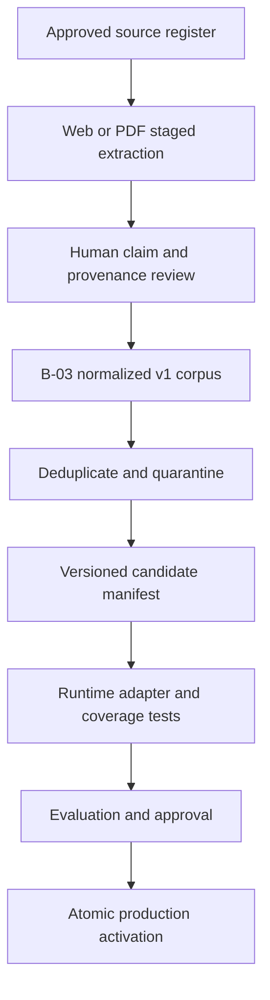

# Production corpus expansion and activation

**Current state:** six active legacy records  
**Expansion status:** staging only  
**Activation decision:** not yet approved

## When production should expand

Do not expand the production corpus immediately after B-03 or B-04. Those tickets make inputs reproducible; they do not yet provide PDF extraction, deduplication, quarantine, a corpus manifest, complete three-theme curation, coverage tests, or a runtime migration.

The first production expansion should occur only after all of these gates pass:

| Gate | Required evidence |
|---|---|
| Pipeline safety | B-03 through B-08 complete: structured/web/PDF ingestion, deduplication, quarantine, and a versioned manifest. |
| Human curation | B-09 provides 10–20 reviewed credible sources per approved theme, with source roles, claim locators, limitations, and access/license notes. |
| Runtime compatibility | A tested activation adapter converts the frozen v1 corpus into the current API's runtime `EvidenceRecord` contract, or the runtime is migrated to read v1 directly. No lossy or implicit field mapping is allowed. |
| Retrieval coverage | B-10 passes representative theme queries, role-specific queries, unrelated refusals, and regression cases against the exact candidate corpus. |
| Comparative evaluation | B-11 reruns the frozen evaluation and human-review sample; regressions are fixed or explicitly accepted before release. |
| Operations | B-12 documents add/update/remove, rebuild, failure inspection, activation, health verification, and rollback. |

Therefore the safest answer to “when” is: **after B-11 passes and as part of B-12 release-runbook sign-off—not on a calendar date and not merely when source count reaches a target.**

## How expansion should work

### 1. Curate by theme and source role

Build a reviewed register for exactly the three approved themes. Target 10–20 credible records per theme, but do not fill quotas with weak or redundant material. Preserve effectiveness, context, design, and evidence-map roles. Only qualified effectiveness claims may influence evidence strength or pilot recommendations.

### 2. Extract without inference

Use B-04 for allowed HTML pages and B-05 for PDFs. Store raw response/document hashes and stable locators. Extraction is not claim generation.

### 3. Review and normalize

Nicole or a named reviewer confirms each source's provenance, access/license status, source role, evidence strength where eligible, claims, limitations, and implementation implications. Then B-03 generates the normalized candidate.

### 4. Validate the candidate

B-06 removes exact/configured near duplicates. B-07 quarantines invalid records with visible reasons. B-08 freezes the surviving IDs, hashes, counts by theme/role, schema version, and generated date in a corpus manifest.

### 5. Bridge the schema boundary explicitly

The production API currently reads the six-record legacy `EvidenceRecord` JSON format, while Phase B produces `EvidenceCorpusV1`. A dedicated activation adapter or runtime migration is required. It must fail on unmapped required fields and must never infer missing outcomes, populations, comparisons, or pilot metrics.

### 6. Test before activation

Run B-10 against the exact candidate manifest, then B-11 against the unchanged v0.1 evaluation set plus new coverage cases. Report both improvements and regressions; a larger source count alone is not success.

### 7. Activate atomically and verify

Activation should be one reviewed PR containing the candidate manifest, runtime-compatible corpus or reader change, test reports, and rollback identifier. Replace the active corpus atomically, deploy, verify `/health`, run representative `/api/ask` checks, confirm record/theme/role counts, and monitor logs for load or validation failures.

## Rollback

Retain the exact previous six-record corpus and code commit. If loading, retrieval, synthesis, citation, or refusal behavior regresses:

1. restore the previous corpus/code pair through a revert PR;
2. redeploy;
3. verify `/health`, corpus count, one supported query, one context-only query, and one unrelated refusal;
4. keep the rejected candidate and validation report in staging for correction.

Production rollback must restore both data and compatible reader code; rolling back only one side can leave the API unable to load its corpus.
